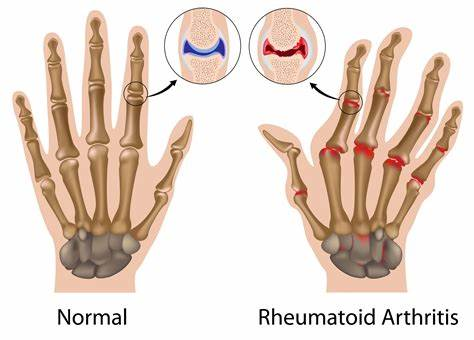
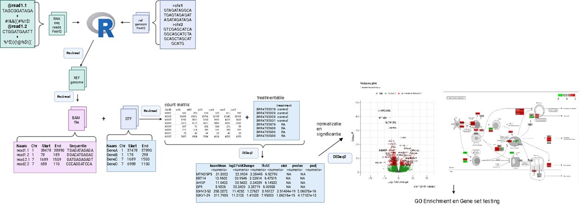
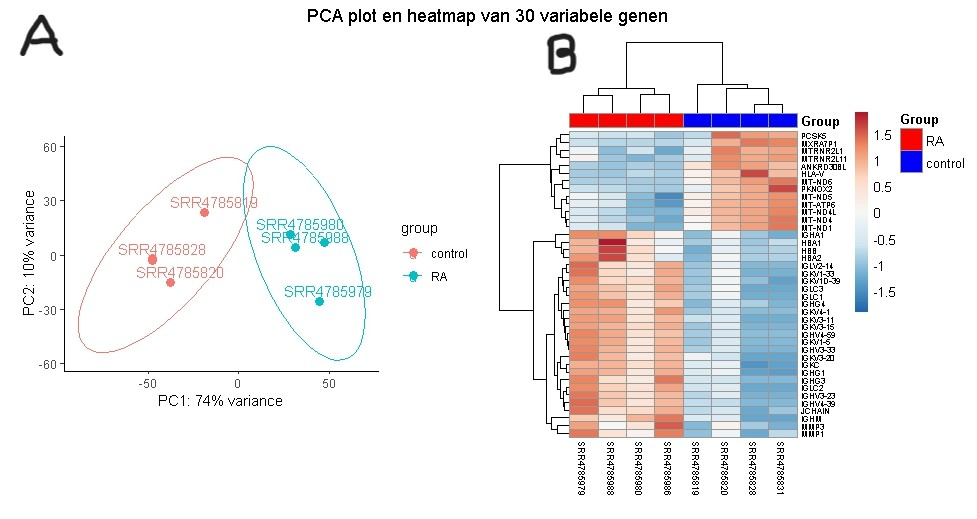
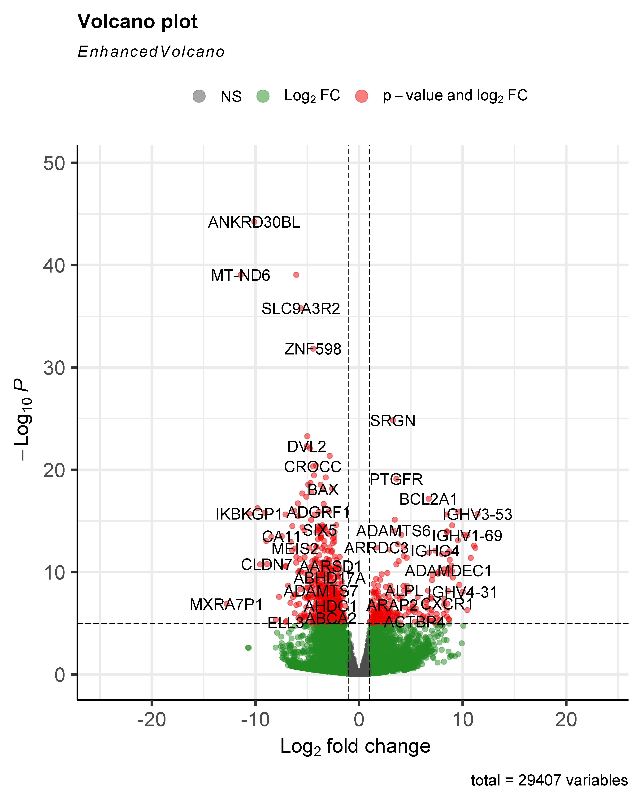
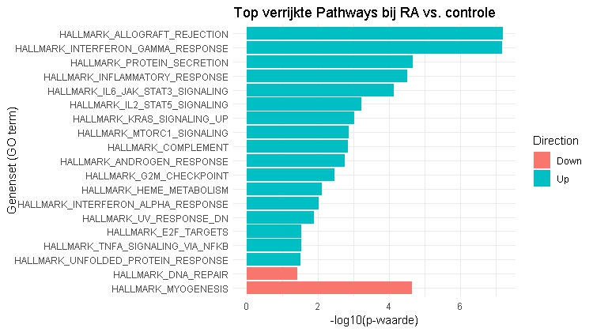
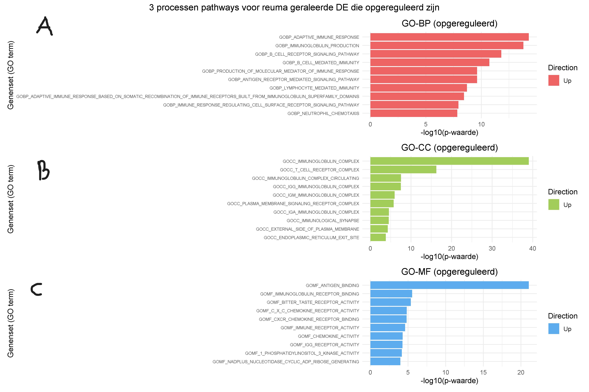
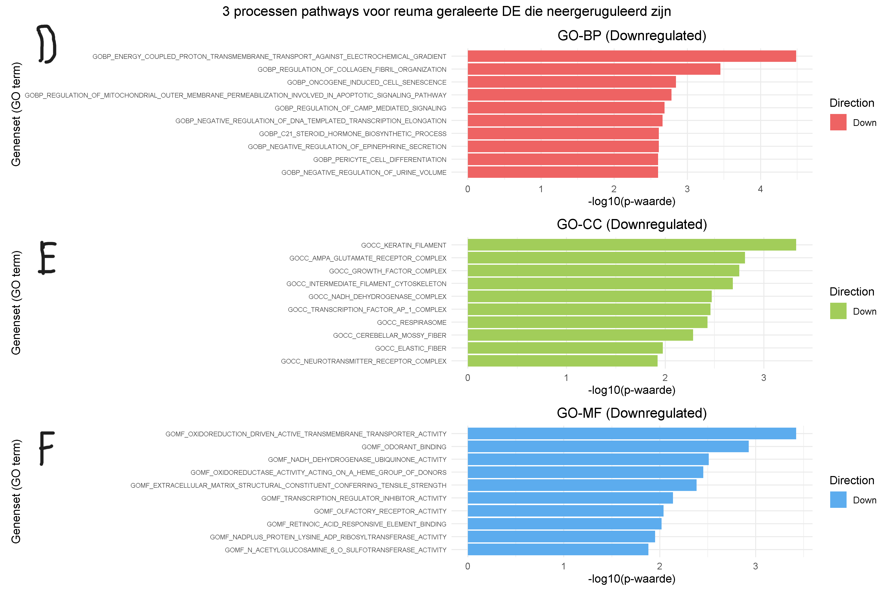

# Transcriptomics-BM2C

  

Door: ELisabeth Cezner

klas:BML2-C

## H1 Inleiding
Reumatoïde artritis (RA) is een systematische auto-immunziekte dat voornamelijk de gewrichten van voeten en handen aantast en vooral bij vrouwen. Alhoewel de exacte oorzaak Reumatoïde artritis onduidelijk is, is het zeker dat omgevingsfactoren en genetischefactoren van invloed zijn op Reumatoïde artritis (Huang et al., 2021). De meest belangrijkste genitisch risico zit in het  MHC class II HLA-DR4 allel dat op APC voorkomt in 70% van RA patienten zit (Firestein & McInnes, 2017) en bevat een 5 aminzuur sequentie motief dat de "shared epitope" heet (Fu et al., 2018) dat goede binding heeft voor gecitrullineerde eiwitten en presenteren aan CD4 cellen die weer B-cellen activeren en antistoffen maken tegen citrullinated peptide (ACPA)(Smith & Haynes, 2002). Deze gecitruleerde eiwitten worden o.a. gevormd onder invloed van roken, waarbij het enzym PAD1 arginine omzet in citrulline (Firestein & McInnes, 2017). Een voorbeeld van gecitrulleerde eiwit is citrullinated vimentin dat voor komt in de sinovitus, ACPA bind aan de gecitruleerde eiwit wat tot leid een immuncomplex en verdere immuncellen activeert. Wat een kenemerkende symptomen geeft van RA zoals zwelling in de gewricht(Jang, S ., et al, 2022). Er is nog geen medicijn die RA geneest, maar wel medicijnen die de immunsysteem onderdrukt(Jang, S ., et al, 2022). Door de complexiteit van de oorzaken van RA is verder onderzoek naar de betrokken genen noodzakelijk om betere behandelingen te ontwikkelen. Met als doel met behulp van transcriptomics te onderzoeken welke genen en pathways betrokken zijn bij het onstaan van RA.

## H2 Methode
Om te achterhalen welke genen en pathways betrokken zijn bij Reumatoïde artritis werd met behulp van geanalyseerd (fig. 1).

  

*Figuur 1: flowschema van de dataverwerking in R.*

### H2.1 Verkregen data
De data van de RNA sequenties werden verkregen uit monsters genomen van het synovium van 4 patiënten met RA en 4 patiënten zonder RA. Patienten met reuma waren bevestigd dat die autoantistoffen hebben tegen CCP. Hieronder een overzicht van de [monsters](data/metadata_rheuma.csv).

### H2.2 Mappen van data en countmatrix
Met RSUBread (versie 2.20.0) (Liao et al., 2019) werd de humaan genoom [GRCh38.p14](https://ftp.ensembl.org/pub/release-114/fasta/homo_sapiens/dna/Homo_sapiens.GRCh38.dna.toplevel.fa.gz) van ENSEMBL en de [monster reads](data/Data_RA_raw) gemapt. Zodat het align-programma weet waar in het genoom de reads passen van de monsters. Uit de align functie kwamen bam files die samen met [Homo_sapiens gtf](https://ftp.ensembl.org/pub/release-114/gtf/homo_sapiens/Homo_sapiens.GRCh38.114.gtf.gz) file van ENSEMBL tot een countmatrix werd gemaakt met behulp van RSUBread. In de countmatrix staat hoeveel reads in de gen voorkwam bij de controle en reuma monsters.

### H2.3 Statistiek
Vanaf dit punt werd de vollidig human genoom [countmatrix](data/count_matrix.txt) verkregen. Met de treatmentable waarin staat of de monster controle of reuma is en countmatrix werd de DESeqDataSet object gemaakt met behulp van DESeq2 (versie 1.46.0) (Love et al., 2014), waarin de DESeqDataSet in staat de foldchange, p-value en multiple testing correction (benjamin hochwald) voor de normaliseerde genen. Met DESeqDataSet werd een volcano plot gemaakt waarin de foldchange werd uitgezet tegen de significantie. Verder werd met de DESeqDataSet een KEGG pathway-analyse gedaan, GO enrichment en Gene set testing gedaan.

## H3 Resultaten
Om te zien welke genen en pathways betrokken zijn werd er een PCA plot, volcano plot, GO-enrichment en Gene set testing.

### H3.1 De genexpressie tussen groepen verschilt
Om te onderzoeken of de genexpressie verschilde tussen- reuma en controle samples, werd een PCA-plot uitgevoerd (fig. 2A). hieruit bleek dat de samples goed van elkaar clusteren. Dat ook bevestigd is met een PERMANOVA op basis van de euclidisch afstand (P = 0.026, 999 permutaties). Om te onderzoeken welke genen deze scheiding aansturen, werd een heatmap gemaakt van de top 20 DE gebrachte genen (Fig. 2B).

  

*Figuur 2 (A) Verschil in genexpressie tussen reuma- en controle samples. Euclidisch afstand bepaald met PCA methode, tussen reuma- en controle samples. (reuma , N=4), (controle , N=4). (B) De Heatmap laat zien 30 genen die differentieel in expressie zijn.*

### H3.2 Meerdere genen zijn significant in expressie
Om een beeld te krijgen welke genen upregulated of downregulted in expressie zijn , werd een volcano plot gemaakt. Uit de volcano plot beek dat 2085 genen significant upregulted zijn bij reuma en 2487 genen significant downregulated zijn. Een opvallend upregulated gen is SRGN met log2Foldchange van 3.26256 en p-waarde van 4.36 x 10^29 (fig. 3).

  

*Figuur 3: Volcanoplot van differentiele gene-expressie (DE) bij reuma (N=4) en controle (N=4). De significantie is tot -log10 geplot tegen de log2 van de foldchange. Grijze punten geven genen aan zonder significant verschil in expressie tussen reuma en de controle, groen geeft aan genen die alleen voldoen aan log2FoldChange bij reuma of controle en rood geeft genen aan die zowel aan p-waarde en log2FoldChange voldoen bij reuma of controle.*

### H3.2 Meerdere biologische processen zijn betrokken
Om te onderzoeken welke pathways betrokken zijn bij reuma, werd gene set enrichment gebruikt. De Hallmark-database gaf een breed scala aan biologische processe. Er werd een significante aantal genen gevonden in de myogenese, allograft rejection en interferon alpha repsons (fig. 4).

  

*Figuur 4: [Hallmark pathway enrichment analyse](resultaten/pathway_enrichment_Hallamrk.csv) van RA op-en neergeruguleerde pathways (19 pathways significant van totaal 50 pathways).*

Daarnaast werden op- en neergereguleerde genen geïdentificeerd om precieser te zien welke pathways betrokken zijn. In GO-BP upgereguleerd domineert adaptive immune respons en bij neergereguleerd elcetrochemical radiant (fig 5A, D). In GO-CC upgereguleerd domineert immunoglobin complex en bij neergeruguleerd keratin filament (fig 5B, E). In GO-MF upgereguleerd antigen binding en bij neergereguleerd transmembrane transporter activity (fig 5C, F).

  
  

*Figuur 5: Verrijkingsanalyse voor opgereguleerde [BP](pathway_enrichment_BP.csv), [CC](pathway_enrichment_CC.csv) en [MF](pathway_enrichment_MF.csv) pathways (A, B, C) en neergereguleerde pathways van BP, CC en MF (D, E, F).*

