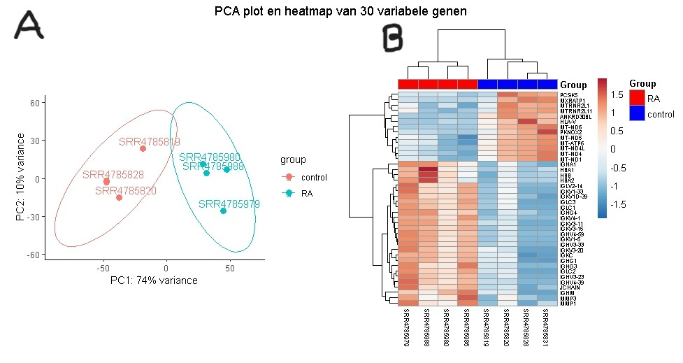
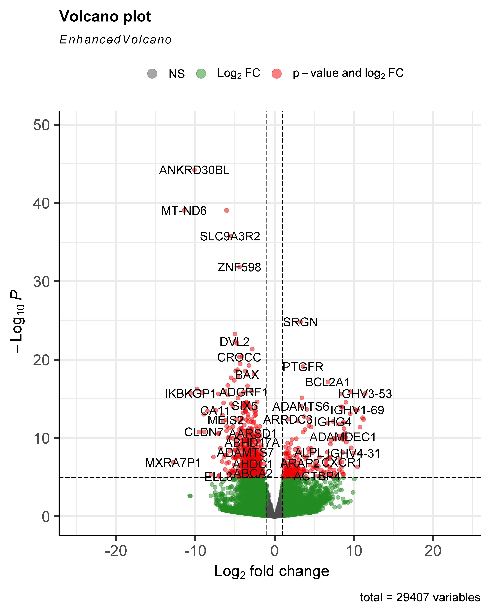
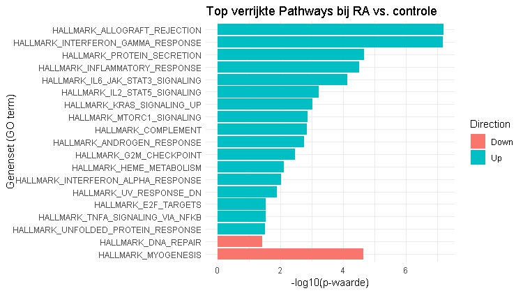
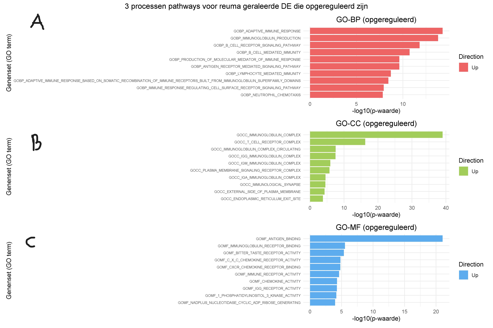
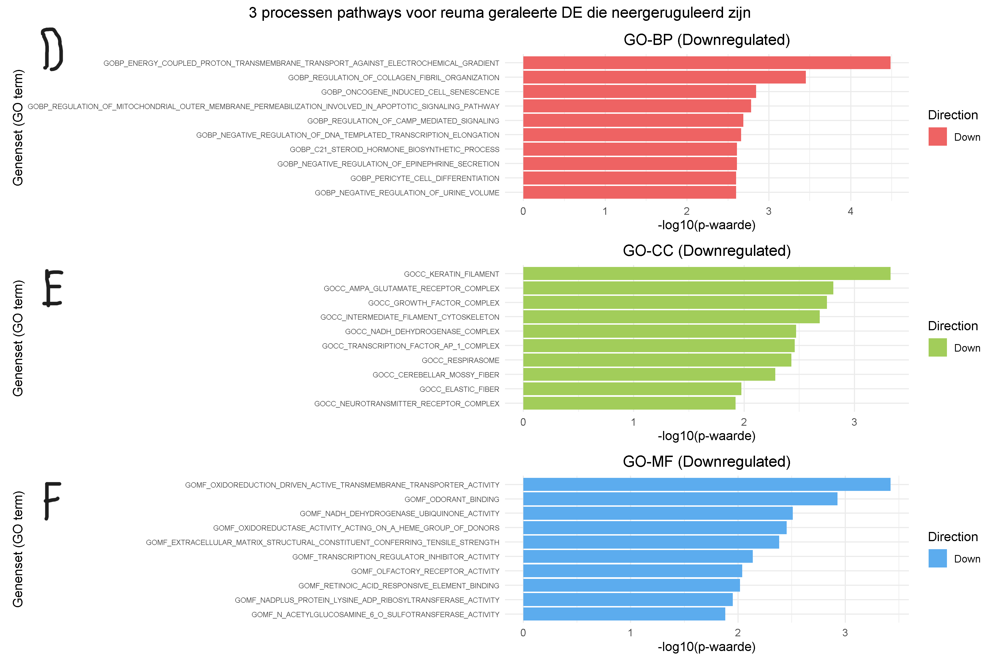

# Transcriptomics-BM2C

  

Door: ELisabeth Cezner

klas:BML2-C

---
## Inhoud/structuur

- `assets/` - overige documenten voor de opmaak van deze pagina
- `bronnen/` – gebruike wetenschappelijke bronnen voor introductie en discussie
- `data/Data_RA_raw/` – monster reads van patienten met en zonder reuma
- `data/` – gebruikte files om de complete dataset te analyseren
- `data_stewardship/` - uitleg waarom data beheren nuttig is
- `resultaten/pathway analyse files` - files van de verschillende pathway analyses voor elke proces
- `resultaten/pathway bam files` - files dat uit de align functie kwam
- `resultaten/genen analyse files` - file van allerlei genen betrokken
- `resultaten/plot` - grafieken van de analyses
- `script/` – scripts de data te verwerken en analyseren
- `README.md` - het document om de tekst hier te genereren

---

## H1 Inleiding
Reumatoïde artritis (RA) is een systematische auto-immunziekte dat vooral de gewrichten in handen en voeten aantast en vooral voorkomt bij vrouwen. Hoewel de exacte oorzaak Reumatoïde artritis onduidelijk is, spelen zowel omgevingsfactoren en genetischefactoren invloed op Reumatoïde artritis (Huang et al., 2021). De belangrijkste genetische risico bevindt zich in het  MHC class II HLA-DR4 allel dat voorkomt op APC en aanwezig is bij 70% van RA-patienten ([Firestein & McInnes, 2017](bronnen/Firestein_2017.pdf)). De allel bevat een specifiek  motief van 5 aminozuur sequentie, bekend als het "shared epitope", ([Fu et al., 2018](bronnen/fu_2018.pdf)) dat sterk bind aan gecitrullineerde eiwitten. Die binding leidt tot presentatie aan CD4 T-cellen die weer B-cellen activeren om antistoffen te maken tegen gecitrullineerde peptiden (ACPA)([Smith & Haynes, 2002](bronnen/smith_en_haynes_2002.pdf)). Deze gecitruleerde eiwitten worden o.a. gevormd onder invloed van roken, waarbij het enzym PAD1 arginine omzet in citrulline ([Firestein & McInnes, 2017](bronnen/Firestein_2017.pdf)). Een voorbeeld van gecitrulleerde eiwit is citrullinated vimentin dat voor komt in de sinovitus. ACPA bind aan dit gecitruleerde eiwit wat leid tot een immuncomplex en verdere immuncellen activeert. Wat een kenemerkende symptoom geeft van RA zoals zwelling in de gewricht([Jang, S ., et al, 2022](bronnen/jang_2022.pdf)). Er bestaat nog geen medicijn dat RA geneest, maar medicijnen die de immunsysteem onderdrukt([Jang, S ., et al, 2022](bronnen/jang_2022.pdf)). Door de complexe oorzaken van RA is verder onderzoek naar de betrokken genen noodzakelijk om betere behandelingen te ontwikkelen. Met als doel met behulp van transcriptomics te onderzoeken welke genen en pathways betrokken zijn bij het onstaan van RA.

## H2 Methode
Om te achterhalen welke genen en pathways betrokken zijn bij Reumatoïde artritis werd met behulp van transciptomics geanalyseerd (fig. 1).

  

*Figuur 1: flowschema van de dataverwerking in R.*

### H2.1 Verkregen data
De data van de RNA sequenties werden verkregen uit monsters genomen van het synovium van 4 patiënten met RA en 4 patiënten zonder RA. Patienten met reuma waren bevestigd dat die autoantistoffen hebben tegen CCP. Hieronder een overzicht van de [monsters](data/metadata_rheuma.csv).

### H2.2 Mappen van data en countmatrix
Met RSUBread (versie 2.20.0) ([Liao et al., 2019](bronnen/Yang_Liao_2019.pdf)) werd de humaan genoom [GRCh38.p14](https://ftp.ensembl.org/pub/release-114/fasta/homo_sapiens/dna/Homo_sapiens.GRCh38.dna.toplevel.fa.gz) van ENSEMBL en de [monster reads](data/Data_RA_raw) gemapt. Uit de align functie kwamen [bam files](resultaten/bam%20files) die samen met [Homo_sapiens gtf](https://ftp.ensembl.org/pub/release-114/gtf/homo_sapiens/Homo_sapiens.GRCh38.114.gtf.gz) file van ENSEMBL tot een countmatrix werd gemaakt met behulp van RSUBread.

### H2.3 Statistiek
Vanaf dit punt werd de vollidig human genoom [countmatrix](data/count_matrix.txt) verkregen. Met de treatmentable waarin staat of de monster controle of reuma is en countmatrix werd de DESeqDataSet object gemaakt met behulp van DESeq2 (versie 1.46.0) ([Love et al., 2014](bronnen/Micheal_I_love_2014.pdf)), waarin de DESeqDataSet in staat de foldchange, p-value en multiple testing correction (benjamin hochwald) voor de normaliseerde genen. Met DESeqDataSet werd een volcano plot gemaakt waarin de foldchange werd uitgezet tegen de significantie. Verder werd met de DESeqDataSet een KEGG pathway-analyse gedaan, GO enrichment en Gene set testing gedaan.

## H3 Resultaten
Om te zien welke genen en pathways betrokken zijn werd er een PCA plot, volcano plot, GO-enrichment en pathway analyse gedaan.

### H3.1 De genexpressie tussen groepen verschilt
Om te onderzoeken of de genexpressie verschillen tussen- reuma en controle samples, werd een PCA-plot uitgevoerd (fig. 2A). Hieruit bleek dat de samples goed van elkaar clusteren. Dat ook bevestigd is met een PERMANOVA op basis van de euclidische afstand (P = 0.026, 999 permutaties). Om te onderzoeken welke genen deze scheiding aansturen, werd een heatmap gemaakt van de top 30 DE gebrachte genen (Fig. 2B).

  

*Figuur 2 (A) Verschil in genexpressie tussen reuma- en controle samples. Euclidisch afstand bepaald met PCA methode, tussen reuma- en controle samples. (reuma , N=4), (controle , N=4). (B) De Heatmap laat zien 30 genen die differentieel in expressie zijn.*

### H3.2 Meerdere genen zijn significant in expressie
Om een beeld te krijgen welke [genen opgereguleerd of neergereguleerd](resultaten/genen%20analyse%20files/ResultatenGenen.csv) in expressie zijn , werd een volcano plot gemaakt. Uit de volcano plot beek dat 2085 genen significant opgereguleerd waren bij reuma en 2487 genen significant neergereguleerd waren. Een opvallend opgereguleerd gen is SRGN met log2Foldchange van 3.26256 en p-waarde van 4.36 x 10^29 (fig. 3).

  

*Figuur 3: Volcanoplot van differentiele gene-expressie (DE) bij reuma (N=4) en controle (N=4). De significantie is tot -log10 geplot tegen de log2 van de foldchange. Grijze punten geven genen aan zonder significant verschil en lage foldchange tussen reuma en de controle, groen geeft aan genen die alleen voldoen aan log2FoldChange bij reuma of controle en rood geeft genen aan die zowel aan p-waarde en log2FoldChange voldoen bij reuma of controle.*

### H3.2 Meerdere biologische processen zijn betrokken
Om te onderzoeken welke pathways betrokken zijn bij reuma, werd de pathway analyse uitgevoerd. De Hallmark-database bood hierbij een overzicht van diverse relevante processen. De analyse toonde een significante aantal pathways in de myogenese, allograft rejection en interferon alpha repsons (fig. 4).

  

*Figuur 4: [Hallmark pathway enrichment analyse](resultaten/pathway_enrichment_Hallamrk.csv) van RA op-en neergeruguleerde pathways (19 pathways significant van totaal 50 pathways)(q = <0.05)(Benjamini Hochberg).*

Daarnaast werden op- en neergereguleerde genen geïdentificeerd om precieser te zien welke pathways betrokken zijn. In GO-BP opgereguleerd domineert adaptive immune respons en bij neergereguleerd elcetrochemical radiant (fig 5A, D). In GO-CC opgereguleerd domineert immunoglobin complex en bij neergeruguleerd keratin filament (fig 5B, E). In GO-MF opgereguleerd antigen binding en bij neergereguleerd transmembrane transporter activity (fig 5C, F).

  
  

*Figuur 5: Top 10 verrijkingsanalyse voor opgereguleerde [BP](resultaten/pathway%20analyse%20files/pathway_enrichment_BP.csv), [CC](resultaten/pathway%20analyse%20files/pathway_enrichment_CC.csv) en [MF](resultaten/pathway%20analyse%20files/pathway_enrichment_MF.csv) pathways (A, B, C) en neergereguleerde pathways van BP, CC en MF (D, E, F)(p = <0.05).*

Verder werd de go enrichment uitgevoerd om te zien welk processen betrokken zijn, daaruit kwam dat bij BP positieve RNA regulatie domineert, bij MF domineert protein binding en bij CC domineert cytosol (fig 6).

  

*Figuur 6: Top 30 ontologies voor opgereguleerde go enrichment proccesen bij BP, CC en MF (padj = <0.05).*

## Conclusie
RA is een auto-immuunziekte die beinvloed word door zowel genetische als omgevingfactoren, maar is het mogelijk dat nog meer pathways/genen betrokken zijn betrokken zijn bij het onstaan van RA, met als doel om te achterhalen welke genen en pathways betrokken zijn bij het onstaan van RA.

Uit de volcano plot kwam de de meest opgereuduleerde gen SRGN in reuma patienten voorkomt. SRGN is betrokken bij ontstekingsprocessen doordat het de productie van TNF-α reguleert en het NF-κB-pathway activeert ([Chen et al., 2020](bronnen/Yueying20%Chen_2020.pdf)), dat zorgt voor weefselafsterfte en auto-immunreacties ([Liu et al., 2017](bronnen/Ting_Liu_2017.pdf); [D. Jang et al., 2021](bronnen/Dan-in_Jang_2021.pdf)). Bij de hallmark-analyse kwam de meest upgerugeerlde pathway allograft rejection dat gedoneerde weefsel afstoot, hoewel er geen weefsel is gedoneert is er wel overlap met ander immunomechanismes. De meest neergeruguleerde pathway was myogenisis (spieraanmaak). Deze verstoring zou verband kunnen houden met overproductie van myostatine, een remmer van spiergroei([Gonzalez-Ponce et al., 2024](bronnen/Fabiola_Gonzalez-ponce_2024.pdf)).

Toch heeft dit onderzoek een paar beperking. Er moet rekening worden gehouden met enkele beperkingen van dit onderzoek. Ten eerste is meer aantal samples nodig en daarbij ook samples van mannen met en zonder reuma. Om te zien of sex ook andere andere pathways activeert. Ook voor meer biologische diepgang en communicatie tussen cellen kan meer verschillende celtypes worden gesequenced zoals type immuncellen en epitheel cellen.

Een groot aantal pathways geeft beeld hoe reuma kan onstaan zoalas de immunpathways en MHC binding pathways, maar specifieke chemokine is onbekend wat laat zien waar de immuncellen worden "gelokt".
