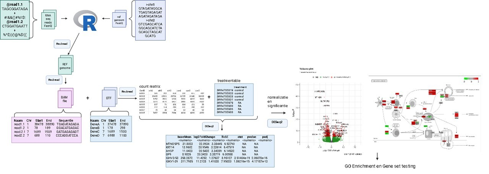

# Transcriptomics-BM2C

  

## H1 Inleiding
Reumatoïde artritis (RA) is een systematische auto-immunziekte dat voornamelijk de gewrichten van voeten en handen aantast en vooral bij vrouwen. Alhoewel de exacte oorzaak Reumatoïde artritis onduidelijk is, is het zeker dat omgevingsfactoren en genetischefactoren van invloed zijn op Reumatoïde artritis (Huang et al., 2021). De meest belangrijkste genitisch risico zit in het  MHC class II HLA-DR4 allel dat op APC voorkomt in 70% van RA patienten zit (Firestein & McInnes, 2017) en bevat een 5 aminzuur sequentie motief dat de "shared epitope" heet (Fu et al., 2018) dat goede binding heeft voor gecitrullineerde eiwitten en presenteren aan CD4 cellen die weer B-cellen activeren en antistoffen maken tegen citrullinated peptide (ACPA)(Smith & Haynes, 2002). Deze gecitruleerde eiwitten worden o.a. gevormd onder invloed van roken, waarbij het enzym PAD1 arginine omzet in citrulline (Firestein & McInnes, 2017). Een voorbeeld van gecitrulleerde eiwit is citrullinated vimentin dat voor komt in de sinovitus, ACPA bind aan de gecitruleerde eiwit wat tot leid een immuncomplex en verdere immuncellen activeert. Wat een kenemerkende symptomen geeft van RA zoals zwelling in de gewricht(Jang, S ., et al, 2022). Er is nog geen medicijn die RA geneest, maar wel medicijnen die de immunsysteem onderdrukt(Jang, S ., et al, 2022). Door de complexiteit van de oorzaken van RA is verder onderzoek naar de betrokken genen noodzakelijk om betere behandelingen te ontwikkelen. Met als doel met behulp van transcriptomics te onderzoeken welke genen en pathways betrokken zijn bij het onstaan van RA.

## H2 Methode
Om te achterhalen welke genen en pathways betrokken zijn bij Reumatoïde artritis werd met behulp van geanalyseerd (fig. 1).

  

*Figuur 1: flowschema van de dataverwerking in R.*

### H2.1 Verkregen data
De data van de RNA sequenties werden verkregen uit monsters genomen van het synovium van 4 patiënten met RA en 4 patiënten zonder RA. Patienten met rheuma waren bevestigd dat die autoantistoffen hebben tegen CCP. Hieronder een overzicht van de [monsters](data/metadata_rheuma.csv).

### H2.2 Mappen van data en countmatrix
Met RSUBread (versie 2.20.0) (Liao et al., 2019) werd de humaan genoom [GRCh38.p14](https://ftp.ensembl.org/pub/release-114/fasta/homo_sapiens/dna/Homo_sapiens.GRCh38.dna.toplevel.fa.gz) van ENSEMBL en de [monster reads](data/Data_RA_raw) gemapt. Zodat het align-programma weet waar in het genoom de reads passen van de monsters. Uit de align functie kwamen bam files die samen met [Homo_sapiens gtf](https://ftp.ensembl.org/pub/release-114/gtf/homo_sapiens/Homo_sapiens.GRCh38.114.gtf.gz) file van ENSEMBL tot een countmatrix werd gemaakt met behulp van RSUBread. In de countmatrix staat hoeveel reads in de gen voorkwam bij de controle en rheuma monsters.

### H2.3 Statestiek
Vanaf dit punt werd de vollidig human genoom [countmatrix](data/count_matrix.txt) verkregen. Met de treatmentable waarin staat of de monster controle of rheuma is en countmatrix werd de DESeqDataSet object gemaakt met behulp van DESeq2 (versie 1.46.0) (Love et al., 2014), waarin de DESeqDataSet in staat de foldchange, p-value en multiple testing correction (benjamin hochwald) voor de normaliseerde genen. Met DESeqDataSet werd een volcano plot gemaakt waarin de foldchange werd uitgezet tegen de significantie. Verder werd met de DESeqDataSet een KEGG pathway-analyse gedaan, GO enrichment en Gene set testing gedaan.

## H3 Resultaten
Om te zien welke genen en pathways betrokken zijn werd er een PCA plot, volcano plot, GO-enrichment en Gene set testing.

### H3.1 De gen expressie tussen groepen verschilt
Om te zien of de gen expressie verschilt van rheuma en controle samples werd een PCA plot uitgevoerd (fig. 2). 
